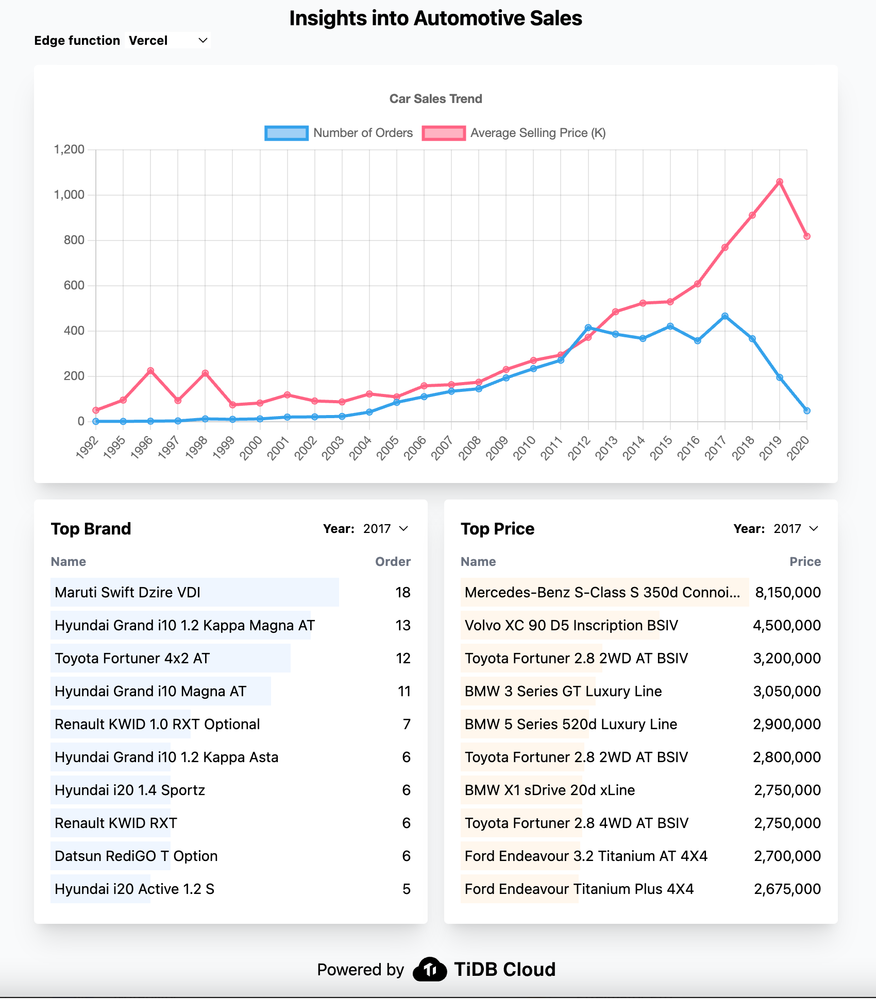

# Car Sales Insight

Insight car sales trends using TiDB serverless driver and edge functions. Try out the [live demo](https://car-sales-insight.vercel.app/).



## How it works

The data is stored in a TiDB Serverless. You can find the schema and data [here](./database).

The backend is run on the edge (Vercel edge Function, Netlify Edge Function and Cloudflare Workers). You can find the codes [here](./examples).

The frontend is developed by next.js and deployed on the Vercel. It should also be able to deploy on Netlify or Cloudflare Page.

## Edge Solution

Learn best practices for connecting TiDB serverless from the edge:

- [Vercel](./examples/vercel)
- [Netlify](./examples/netlify)
- [Cloudflare Workers](./examples/cloudflare-workers)

## Deploy

You can deploy the frontend locally or on the deployment platform.

### Deploy Locally

1. Clone the code

```
git clone git@github.com:tidbcloud/car-sales-insight.git
cd car-sales-insight
```

2. Run the frontend

```
npm install
npm run dev
```

### Deploy on the Vercel

Deploy with one click:

[](https://vercel.com/new/clone?repository-url=https%3A%2F%2Fgithub.com%2Ftidbcloud%2Fcar-sales-insight)
